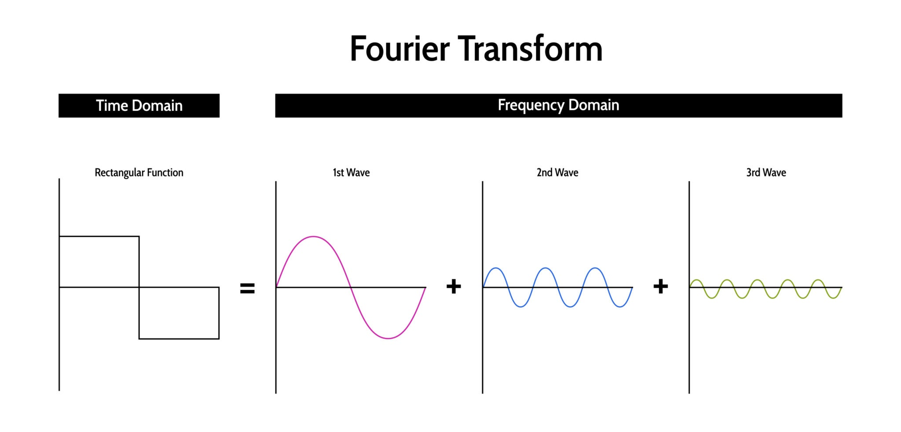

# _EEG signal feature extraction applications_

## **A. Evolution of EEG feature extraction methods:**

1. The Necessity of Feature Extraction (Dimensionality Reduction)

   1.1. Handling **Big Data**:

   - _EEG acquisition often involves multi-hour recordings across multiple channels (electrodes). This generates massive datasets that are computationally expensive to process in their raw form._

     1.2. Data Compaction:

   - _The core goal of feature extraction is dimensionality reduction. By transforming raw data into a set of distinct features, researchers can represent the essential characteristics of the signal using a much smaller, more manageable subset of data._

     1.3. Enabling **AI/ML** Efficiency:

   - _This reduction is crucial for the subsequent stage of the pipeline. It facilitates the efficient use of Machine Learning (ML) and Artificial Intelligence (AI) algorithms, which require concise and relevant inputs to train classification and diagnostic models effectively._

2. The Complex Properties of EEG Signals

   _EEG signals are not simple waveforms. A robust end-to-end pipeline must account for the fact that EEG signals are:_

   2.1. Non-stationary:

   - _The statistical properties of brain signals (such as mean and variance) change over time. A signal observed at one moment may look statistically different a few minutes later, meaning simple static analysis often fails._

     2.2. Non-linear:

   - _The brain is a complex dynamical system. The relationship between neural inputs and outputs is not linear, meaning the signals contain chaotic patterns that linear methods (like simple averaging) might miss._

     2.3. Non-Gaussian:

   - _The distribution of EEG data points typically does not follow a standard normal (bell curve) distribution._

     2.4. Non-short form:

   - _Due to the clinical need for long-term monitoring (e.g., sleep studies or seizure monitoring), the data is continuous and extensive rather than short, discrete snippets._

**_Conclusion_**: Therefore, the "evolution" of these methods described in the paper is a history of moving from simple techniques to advanced algorithms (like Wavelet Transforms or Fractal Dimension analysis) specifically designed to capture useful information despite the non-linear and non-stationary nature of the human brain.

##### **_End of Evolution of EEG feature extraction methods_**\_\*\*\*\*

---

## **B. Process and Challenges:**

1.  **The process of EEG feature extraction** is not a single calculation but a structured workflow designed to convert raw, complex brain signals into usable data for machine learning.

    **Step 1**: _Pre-requisite: Signal Pre-processing_

        Before extraction begins, the raw EEG signal (which is often noisy and contains artifacts like muscle movement or power line interference) must be cleaned.This typically involves filtering (e.g., bandpass filters) to isolate the relevant frequency bands (0.5–100 Hz)

    **Step 2**: _Windowing and Segmentation (The Critical Step)_

        Because EEG signals are non-stationary (their statistical properties change over time), you cannot simply extract one feature for an entire hour-long recording.

    - **The Process**: The continuous EEG signal is cut into short, fixed-duration time blocks called windows or segments.

    - **The Goal**: By isolating short segments, the signal within that window can be treated as relatively stable (stationary), allowing algorithms to accurately capture local patterns.

    **Step 3**: _Application of Extraction Algorithms (Transformation)_

        Once the signal is segmented, a mathematical algorithm is applied to each window to calculate specific "features". These processes are categoried into domains:

    - Time Domain Process:

      - **_Method_**: Algorithms like Autoregressive (AR) Modeling or Fractal Dimension (Higuchi) are applied directly to the time-series amplitude data.

      - **_Action_**: The algorithm calculates coefficients or complexity values that represent the shape and behavior of the wave in that window.

    - Frequency Domain Process:

      - **_Method_**: Using techniques like the Fast Fourier Transform (FFT).

      - **_Action_**: The signal is converted from time-amplitude to frequency-power, extracting features like Power Spectral Density (PSD) to see which brain waves (Alpha, Beta, etc.) are dominant.

    - Decomposition Domain Process:

        - **_Why Decomposition?_**

            - **Problem with FFT:** The Fast Fourier Transform (FFT) effectively identifies _which_ frequencies are present but fails to indicate _when_ they occur. This is insufficient for **non-stationary** signals like EEG, where events (e.g., seizures) are transient.

            - **Solution:** Decomposition methods break the signal down to provide resolution in both **Time and Frequency** (or Scale) simultaneously.

      - **_Method_**: Using Wavelet Transforms (CWT/DWT) or Local Characteristic-Scale Decomposition (LCSD).

      - **_Action_**: The signal is "decomposed" (broken down) into different scales or sub-bands. This allows the extraction of features that describe both when and at what frequency an event occurred.

    **Step 4**: Formation of Feature Vectors

    - **_Concept:_**

        - This step acts as the crucial bridge between **Signal Processing** and **Machine Learning**. It converts the diverse mathematical outputs from the extraction algorithms into a standardized, structured format that AI models can process.

    - **_The Process:_**

        - Instead of using raw wave data, the specific results calculated in Step 3 (such as AR coefficients, FFT power values, or Fractal indices) are concatenated (joined together) to form a single **1D Array** known as a **Feature Vector**.

        - **Input:** Mathematical parameters extracted from a signal window.
        - **Output:** A concise list of numbers representing that specific window.

    - **_Example:_** `Vector = [AR_Coeff_1, AR_Coeff_2, Fractal_Value, Alpha_Power]`

    - **_Key Goals:_**

        1. **Dimensionality Reduction:** It drastically compresses the data (e.g., reducing 500 raw data points to just 5 features) while retaining the essential characteristics of the signal.
        2. **Standardization:** It organizes the data into a standard structure (Feature Matrix) where rows represent samples and columns represent features, making it ready for classifier training.

    **Step 5**: Feature Selection (Post-Extraction)

    - The paper notes that not all extracted features are useful. The final part of the process is Feature Selection, where algorithms filter out redundant or irrelevant data to ensure only the most discriminative features are sent to the Machine Learning classifier.

    **Summary of the Workflow**:

    <div style="border: 1px solid cyan; padding: 10px; color: yellow; text-align: center; margin: 20px">

    Raw Signal $\rightarrow$ Pre-processing $\rightarrow$ Windowing $\rightarrow$ Mathematical Transformation (Time/Freq/Wavelet) $\rightarrow$ Feature Vector

    </div>

2. **Key challenges** include the complex nature of brain signals (noise, instability/non-stationarity) and the need to reduce big data into compact, useful features.

    * ***Noises***:

        1. *<u>Physiological Artifacts (Biological Noise)</u>*

            ---

            | Artifact Type | Source & Characteristics | Filtering / Removal Techniques |
            | :--- | :--- | :--- |
            | **Ocular (EOG)** | **Source:** Blinking or eye movements.<br>**Trait** (Đặc Điểm): High amplitude, low frequency (<4Hz), mostly frontal (Fp1, Fp2). | **ICA (Independent Component Analysis):** The gold standard for separating eye components.<br>**Regression:** Subtracting EOG channel data.<br>**High-pass filter:** Removes slow drifts but not effective for blinks. |
            | **Muscle (EMG)** | **Source:** Jaw clenching, swallowing, neck tension.<br>**Trait:** High frequency (>20Hz), dense, chaotic "blacking out" of the signal. | **Low-pass filter:** Cut off frequencies above 70-100Hz.<br>**BSS/ICA:** Blind Source Separation.<br>**Wavelet Denoising:** Specific removal of high-freq components. |
            | **Cardiac (ECG)** | **Source:** Heartbeat pulse.<br>**Trait:** Rhythmic spikes (QRS complex), visible in electrodes near the ears/neck. | **ICA:** Isolates the periodic heart component.<br>**Re-referencing:** Changing the reference electrode. |
            | **Sweat / Skin** | **Source:** Perspiration changing skin impedance.<br>**Trait:** Very slow, high-amplitude baseline drifts. | **High-pass filter (0.1Hz - 0.5Hz):** Effectively removes these slow drifts. |
            ---

        2. *<u>Technical & Environmental Artifacts:</U>* These arise from external interference or hardware issues.

            ---

            | Artifact Type | Source & Characteristics | Filtering / Removal Techniques |
            | :--- | :--- | :--- |
            | **Power Line** | **Source:** AC electrical mains (50Hz in EU/VN, 60Hz in US).<br>**Trait:** Constant, perfect sinusoidal wave at exactly 50/60Hz. | **Notch Filter:** Specifically targets and removes the 50/60Hz band.<br>**Shielding:** Proper grounding of the equipment. |
            | **Electrode Pop** | **Source:** Loose contact, dry gel, or movement.<br>**Trait:** Sudden, massive spikes ("pops") or chaotic static. | **Interpolation:** Replacing bad channel data with average of neighbors.<br>**Rejection:** Cutting out the corrupted segment.<br>**Impedance Check:** Preventive measure before recording. |
            | **EM Interference** | **Source:** Wi-Fi, phones, medical equipment.<br>**Trait:** High-frequency noise or specific spikes. | **Band-pass filter:** Keeping only the physiological range (0.5 - 100Hz).<br>**Shielding:** Using Faraday cages or shielded cables. |
            ---

        3. *<u>Standard Preprocessing Pipeline:</u>* To prepare raw EEG data for Feature Extraction and AI training, the following sequence is typically applied:

            *  **High-pass Filter (0.5Hz):** Remove sweat and baseline drift.
            *  **Notch Filter (50/60Hz):** Remove power line noise.
            *  **Low-pass Filter (e.g., 100Hz):** Remove unnecessary high-frequency environmental noise.
            *  **Artifact Removal (ICA/ASR):** Algorithmically identify and subtract EOG (eye) and EMG (muscle) components.
            *  **Re-referencing:** Compute Common Average Reference (CAR) to reduce common systemic noise across all channels.
    
    * ***Inherent Signal Properties***

        The primary challenge in analyzing EEG data is the complex nature of the brain signal itself. EEG signals are difficult to process because they are:

        * **Non-stationary:** The statistical properties (mean, variance) change over time; the signal is not constant.
        * **Non-linear:** The brain is a dynamic system, and its signals do not follow simple linear patterns.
        * **Non-Gaussian:** The data distribution does not follow a standard bell curve.
        * **Non-short form:** Clinical recordings are often continuous and long-term rather than short, discrete segments.

    * ***"Big Data" and High Dimensionality***

        * **Volume:** EEG acquisition often involves **multi-hour recordings** and **multiple channels** (electrodes).
        * **Redundancy:** This generates a massive amount of data, leading to **high dimensionality**.
        * **The Challenge:** Processing raw data is computationally expensive and inefficient. This necessitates effective **Feature Extraction** (to compact data) and **Feature Selection** (to remove redundant channels/features) to avoid **overfitting** in machine learning models.

    * ***Clinical & Application Challenges***

        * **Epilepsy Diagnosis**: Chẩn đoán bệnh động kinh
            * The traditional method is **manual inspection** by epileptologists.
            * This process is described as **long, tedious, and subjective**, leading to potentially different diagnoses from different experts.
            * *Goal:* The challenge is to develop automated, objective systems to replace this manual effort.
        * **Brain-Computer Interfaces (BCI):**
            * There are significant hurdles regarding **usability**, **user training time**, and the **Information Transfer Rate (ITR)** (how fast the computer reacts to the brain).
            * Technical challenges exist in creating a stable communication bridge between the brain and external devices.

    * ***Specific Algorithmic Challenges***

        * **Autoregressive (AR) Modeling:**
            * The main challenge is determining the correct **Model Order ($P$)**.
            * **If Order is too low:** It fails to represent the signal accurately.
            * **If Order is too high:** It introduces and amplifies **noise**.
        * **Nyquist Criterion:**
            * To accurately capture the EEG bandwidth (~100 Hz), the sampling frequency must be at least **200 Hz**. Failure to meet this results in signal aliasing (distortion).

##### **_End of Process and Challenges_**\_\*\*\*\*

---

## **C. Feature Extraction Techniques (Focus):**

The authors categorize and delve into specific algorithms, while providing pseudocode for researchers to replicate:

1. **One-dimensional feature extraction techniques:**

   1.1 **Time domain:** Uses methods like Autoregressive (AR) modeling for data compression, or calculating Fractal Dimension (e.g., Higuchi algorithm) for emotion classification.

    - **Autoregressive (AR) Modeling**

        - **How it works:**
        AR modeling assumes that the current value of a signal can be predicted linearly based on its own previous values. It fits a mathematical equation to the signal window where the current sample is the weighted sum of past samples.

        - **The Feature:**
        The algorithm does not output the predicted signal. Instead, it extracts the **coefficients** (weights) of the equation. These coefficients act as a compressed "fingerprint" representing the structure of the brainwave.

        - **Example:**
        Imagine a signal sequence: `[2, 4, 8, 16]`.

            - The model identifies the underlying rule:
            $Current = 2 \times Previous$.
            - The extracted feature is the coefficient **2**.
            - In complex EEG data, a list of coefficients (e.g., `[0.5, -0.2, 0.8]`) is saved to represent the entire signal segment.

    - **Fractal Dimension (Higuchi Algorithm)**

        - **How it works:**
        This method measures the **complexity** or "roughness" of the time-series signal. It calculates a number that indicates the simple, smooth or chaos of signal in the graph. It is particularly useful for detecting chaotic states in the brain.

        - **The Feature:** A single scalar value (the Fractal Dimension index) ranging typically between 1 and 2.

        - **Example:**

            - **Low Value ($\approx$ 1):** The signal is smooth and regular (e.g., a simple sine wave or deep sleep Delta waves).
            - **High Value ($\rightarrow$ 2):** The signal is jagged, spiky, and highly chaotic (e.g., during an epileptic seizure or intense high-frequency activity).

   1.2 **Frequency/spectral domain (Fast Fourier Transform - FFT)**.

      - **Fast Fourier Transform - FFT**

        - **"Any complex, distorted signal can be decomposed into a sum of simple sinusoidal waves."**

        - The task of FFT is to "dissect" the chaotic EEG signal to reveal exactly which frequency components make it up.

        

        - **The Extracted Feature:**

            Instead of returning a wave that goes up and down over time, FFT returns a chart called the **Power Spectrum**.

            - **X-axis:** Represents the Frequencies (Hz) (e.g., from 1Hz to 50Hz).
            - **Y-axis:** Represents the Strength (Power/Energy) at that specific frequency.

        - **EEG Application Example:**

            You input a 1-second segment of brainwaves from a person who is resting with their eyes closed. The FFT analyzes it and reports:

            - "At **10Hz** (Alpha waves - relaxation), the energy bar is very high."
            - "At **30Hz** (Gamma waves - stress), the energy bar is very low."

        -> **Conclusion:** Based on this power spectrum, the computer knows the person is in a relaxed state.

   1.3 **Decomposition domain:** Use **Wavelet Transform** or **Local Characteristic-Scale Decomposition**

    - **Wavelet Transform (WT)**: 
        
        - Acts like a **"Mathematical Microscope"** with a variable lens.

        - **How it works:** Instead of using infinite sine waves (like FFT), it uses short, finite oscillations called **"Wavelets"**.
            - **Compression (High Frequency):** The wavelet is squashed to detect fast, sharp details (spikes).
            - **Stretching (Low Frequency):** The wavelet is stretched to capture slow, rhythmic patterns.

        - **Types of Wavelet Transform**

            1. **Continuous Wavelet Transform (CWT):**
                - Smoothly varies the scale.
                - Provides a highly detailed, redundant view.
                - **Visual Output:** A **Scalogram** (Heatmap of energy over time).
            2. **Discrete Wavelet Transform (DWT):**
                - Varies scale in discrete steps (powers of 2).
                - Efficient for calculation and data compression.

        - **The Output**
            - **Structure:** A **2D Matrix** (or coefficients map).
            - **Rows:** Scale (Frequency bands).
            - **Columns:** Time points.
        - **Data Example:**
            ```text
            Matrix [Frequency x Time]
            [Low Freq ]  0.2  0.2  0.5  ...
            [Mid Freq ]  0.1  0.9  8.5  ...  <-- High energy at specific time
            [High Freq]  0.0  0.1  0.2  ...
                ```

    - **Local Characteristic-Scale Decomposition (LCSD)**

        - **"Sifting"** or **"Layer peeling"**.
        - **Key Feature:** It is **Adaptive (Data-driven)**. Unlike FFT or Wavelet, which use fixed shapes (sine or wavelet functions) to measure the signal, LCSD lets the signal determine its own basis.
        - **How it works:** It iteratively isolates the fastest oscillating components first, then the slower ones, effectively peeling the signal layer by layer.

      - **The Output**
        - **Structure:** A **Set of Vectors** (List of arrays).
        - **Components:** The signal is split into **Intrinsic Scale Components (ISCs)** or Intrinsic Mode Functions (IMFs).
          - `ISC_1`: Fastest oscillations (Noise/Spikes).
          - `ISC_2`: Middle frequencies.
          - `ISC_n`: Slowest trend (Residue).
      - **Data Example:**

        ```python
        Output = {
            "ISC_1": [Array of 250 points - High Freq],
            "ISC_2": [Array of 250 points - Mid Freq],
            "Residue": [Array of 250 points - Trend]
        }
        ```

2. **Multi-dimensional:** 

    While 1D techniques (AR, FFT, Wavelet) treat signals from each electrode as isolated data streams, **Multi-dimensional techniques** integrate multiple dimensions to capture the "bigger picture" of brain activity. This approach is particularly effective for complex tasks like Brain-Computer Interfaces (BCI).

    2.1 **Joint Time-Frequency Domain (Image-based Approach)**

    * **Concept**:

        Instead of compressing the time-frequency map (like a Scalogram or Spectrogram) into a simple vector of numbers, this approach treats the output as a **2D Image**.

    * **Mechanism**
        * **The Transformation:** The EEG signal is converted into a visual representation (Time on X-axis, Frequency on Y-axis, Color = Energy).
        * **The AI Integration:** Researchers use **Deep Learning** models designed for image recognition (such as **CNNs - Convolutional Neural Networks**) to analyze these images.
        * **Advantage:** The AI can "see" complex patterns and textures in the brainwaves exactly as it recognizes objects in photographs, capturing subtle details that statistical vectors might miss.

    2.2. Spatial Domain (Connectivity & Location)

    * **Concept**:

        This is the defining aspect of "multi-dimensional" analysis in EEG. It focuses on the **physical location** of the electrodes and the **relationships** between them.

    * **The Problem with 1D**

        Analyzing one channel at a time ignores how different parts of the brain communicate. For example, imagining moving the right hand activates the left motor cortex. A single-channel analysis might miss this lateralization pattern.

    * **Key Algorithm**: Common Spatial Patterns (CSP)
        * **Application:** CSP is the gold standard for **Motor Imagery BCI** (classifying thought-induced movements).
        * **How it works:** CSP acts as a spatial filter. It calculates a transformation that **maximizes the variance** (signal strength) for one class (e.g., "Left Hand") while **minimizing the variance** for the other class (e.g., "Right Hand").
        * **Result:** It creates a "map" that highlights exactly which regions of the brain are active for specific tasks, effectively separating the signal from the noise based on location.

***Summary Comparison***

| Aspect | 1D Techniques (Traditional) | Multi-dimensional Techniques (Advanced) |
| :--- | :--- | :--- |
| **Perspective** | Analyzes each electrode wire individually. | Analyzes the entire "bundle" of wires and their interaction. |
| **Input Data** | Time-series numbers or simple vectors. | **2D Images** (Spectrograms) or **Spatial Matrices**. |
| **Added Dimension** | Time/Frequency only. | Adds **Space** (Spatial correlation) or **Visual Structure**. |
| **Typical Models** | SVM, Random Forest, LDA. | **Deep Learning (CNN)**, **CSP Filters**. |

##### **_End of Feature Extraction Techniques_**\_\*\*\*\*

---

## **D. Practical Applications:**

- **Healthcare:** Diagnosing neurological conditions such as epilepsy (seizure detection), Alzheimer's, and assessing mental states (fatigue, emotions).
- **Brain-Computer Interface (BCI):** Supporting assistive technology for people with disabilities, thought-controlled devices, and motor rehabilitation.

##### **_End of Practical Applications_**\_\*\*\*\*

---

## **E. Significance of features for machine learning:**

### Core Principle
* The article emphasizes a critical rule: **"There is no one-size-fits-all method."**

* The optimal extraction technique depends entirely on the **signal characteristics** of the specific neurological phenomenon or task being studied.

### Epilepsy Diagnosis (Seizure Detection) - Chẩn đoán bệnh động kinh
* **Signal Characteristics:** Seizures are **sudden, transient** events. The signal becomes highly **chaotic, non-stationary**, and filled with high-amplitude spikes.
* **Recommended Methods:**
    * **Wavelet Transform (CWT/DWT):** Essential for identifying the distinct **start and end times** of a seizure (Time-Frequency localization), which FFT cannot do.
    * **Fractal Dimension / Entropy:** These nonlinear measures are highly sensitive to the sudden increase in signal "roughness" and chaos during a seizure.

### Brain-Computer Interfaces (BCI - Motor Imagery)
* **Signal Characteristics:** Imagining movements (e.g., moving a hand) causes specific energy changes in specific **brain regions** (Spatial distribution). The system requires **real-time** processing (low latency).
* **Recommended Methods:**
    * **Common Spatial Patterns (CSP):** The gold standard for discriminating between tasks based on **location** (e.g., Left Hemisphere vs. Right Hemisphere activation).
    * **Autoregressive (AR) Modeling:** Highly efficient for data compression and fast calculation, making it ideal for real-time control (e.g., driving a wheelchair).

### Emotion Recognition & Fatigue Analysis
* **Signal Characteristics:** Mental states like fatigue or happiness are often reflected in the **ratio of background rhythms** (e.g., Alpha waves increase when tired; Beta waves increase when alert) over a sustained period.
* **Recommended Methods:**
    * **FFT (Power Spectral Density):** The most effective way to quantify and compare the energy levels of specific frequency bands (Alpha/Beta ratios).
    * **Time-Frequency Images (Spectrograms):** Useful for tracking emotional shifts over time using Deep Learning (CNNs).

### Neurodegenerative Diseases (Alzheimer's / MCI)
* **Signal Characteristics:** Patients often exhibit a **"slowing"** of brain waves and a distinct **loss of complexity** (the signal becomes more regular/predictable than a healthy brain).
* **Recommended Methods:**
    * **Complexity Measures (Lempel-Ziv, Higuchi):** To detect the reduction in non-linear complexity.
    * **LCSD / Wavelet:** To decompose and isolate the specific slow-frequency bands (Delta/Theta) associated with the disease.

### Quick Reference Table

| Application | Key Signal Characteristic | Optimal Methods | Rationale |
| :--- | :--- | :--- | :--- |
| **Epilepsy** | Transient, Chaotic, Spikes | **Wavelet, Fractal Dimension** | Captures the *timing* of the event and the *chaos* of the spikes. |
| **BCI (Motor)** | Spatially distributed, Real-time | **CSP, AR Modeling** | CSP filters by *location*; AR allows *fast* processing. |
| **Emotion/Fatigue** | Rhythmic changes | **FFT (PSD)** | Best for comparing energy in Alpha/Beta bands. |
| **Alzheimer's** | Slowing, Loss of complexity | **Complexity Index, LCSD** | Detects the pathological "simplification" of brain activity. |

### Recommendation: The Hybrid Approach
* Instead of relying on a single method, the most robust pipelines often use a **Hybrid Approach**:
    1.  Extract features using multiple domains (e.g., combine AR coefficients with Wavelet energy).
    2.  Use **Feature Selection** algorithms to mathematically determine which combination yields the highest accuracy for the specific dataset.

##### **_Significance of features for machine learning_**\_\*\*\*\*

---

**Core Purpose:** The article aims to provide a detailed reference, including both theory and practical guidance (via pseudocode), helping researchers apply advanced signal processing techniques to biomedical and AI problems.
